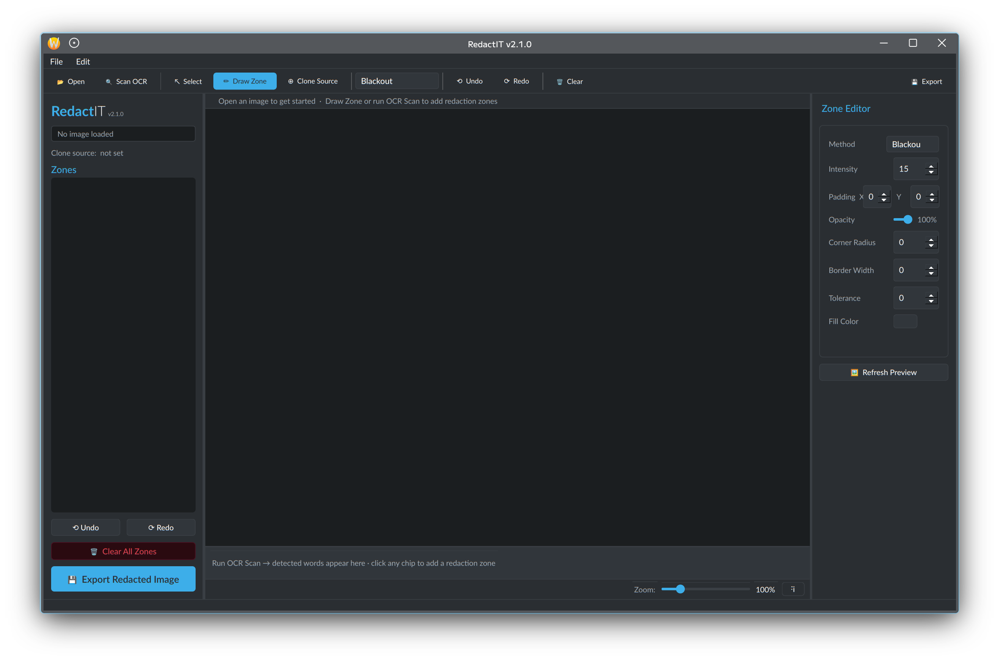

<div align="center">

<br/>

# RedactIT

### A local, privacy-first image redaction tool for Linux

<br/>

[](https://github.com/DitherZ/RedactIT/releases)&nbsp;
[](https://python.org)&nbsp;
[](https://pypi.org/project/PyQt6/)&nbsp;
[](https://kernel.org)&nbsp;
[](LICENSE)

<br/>

> **Open an image. Draw zones. Redact. Export.**
> Nothing leaves your machine.

<br/>

</div>

---

## Overview

**RedactIT** is a lightweight PyQt6 GUI tool for redacting sensitive information from images — IPs, credentials, names, locations, anything you want gone before sharing a screenshot. It runs entirely offline. No uploads, no telemetry, no cloud.

Built for Linux with a KDE-native dark theme (KlassyDark), it supports OCR-assisted text detection, multiple redaction styles, and full per-zone customisation — all in a single Python file.

---

## Features

### Redaction Methods

| Method | Description |
|---|---|
| **Blackout** | Solid fill — customisable colour |
| **Whiteout** | Solid white fill |
| **Blur** | Gaussian blur — variable radius |
| **Pixelate** | Mosaic/pixelation effect |
| **Distort** | Sine-wave spatial warp |
| **Clone Stamp** | Replaces region with content from a chosen source point |

### Zone Customisation

Every redaction zone is independently configurable:

- **Method** — switch any zone to any method at any time
- **Intensity** — controls blur radius, pixelation block size, distort strength
- **Padding X / Y** — expand the zone outward from the drawn region
- **Opacity** — blend the redaction against the original (0–100%)
- **Corner Radius** — rounded rectangle clipping mask
- **Border Width** — optional visible outline (0 = invisible)
- **Tolerance** — feathered/soft edge fade on the redaction boundary
- **Fill Colour** — picker for Blackout/Whiteout fills

### OCR Text Detection

Run the built-in Tesseract OCR scan and every detected word appears as a clickable chip in a strip below the canvas. Click any word chip to instantly create a redaction zone around it. OCR highlights on the canvas are only visible in Select mode — the canvas stays clean otherwise.

### Canvas & Workflow

- **Draw mode** — drag to place a zone anywhere on the image
- **Select mode** — click a zone to load it into the editor; click empty space to deselect
- **Clone Source mode** — click to pick a source region for Clone Stamp zones
- **Scroll-wheel zoom** (10–500%), synced zoom slider in the bottom bar, **Fit** button
- **Non-destructive** — original file is never modified; preview updates live as you edit
- **Undo / Redo** — 60-level stack
- **Alpha-transparent images** — PNG, WEBP, TIFF with transparency are opened, edited, and exported with their alpha channel fully intact. JPEG exports flatten against white (JPEG spec limitation)
- **Export log** written to `~/.log/redactit.log`

---

## Requirements

### System

```
Python 3.10+
tesseract-ocr
```

### Python packages

```
PyQt6 >= 6.4.0
Pillow >= 10.0.0
numpy >= 1.24.0
opencv-python >= 4.8.0
pytesseract >= 0.3.10
```

---

## Installation

### Recommended — setup.py (full install)

Installs pip dependencies, the script, a shell launcher, a `.desktop` entry for your application menu, and an icon:

```bash
git clone https://github.com/DitherZ/RedactIT.git
cd RedactIT
python3 setup.py
```

Then launch from your application menu or terminal:

```bash
redactit
```

### Quick install — deps only, run directly

```bash
git clone https://github.com/DitherZ/RedactIT.git
cd RedactIT
python3 setup.py deps-only
python3 redactit.py
```

### Manual

```bash
# System dependency
sudo apt install tesseract-ocr

# Python dependencies
pip install --break-system-packages -r requirements.txt

# Run
python3 redactit.py
```

### Uninstall

```bash
python3 setup.py uninstall
```

---

## Usage

```
1. Open        — File → Open Image, or click 📂 Open in the toolbar
2. Scan OCR    — Click 🔍 Scan OCR to detect text; word chips appear below the canvas
3. Draw zones  — Drag on the image in Draw mode to place a redaction zone
                 — OR click a word chip to auto-zone a detected word
4. Edit zone   — Select a zone in the left panel; edit it in the Zone Editor on the right
5. Preview     — Preview updates automatically (400ms debounce); click Refresh Preview to force
6. Export      — Click 💾 Export or File → Export to save the redacted image
```

### Keyboard Shortcuts

| Shortcut | Action |
|---|---|
| `Ctrl+O` | Open image |
| `Ctrl+S` | Export redacted image |
| `Ctrl+Z` | Undo |
| `Ctrl+Shift+Z` | Redo |
| `Ctrl+Q` | Quit |
| `Scroll wheel` | Zoom in / out on canvas |

---

## Interface



---

## How OCR Works

RedactIT uses [Tesseract](https://github.com/tesseract-ocr/tesseract) via `pytesseract` to scan the image locally. No image data is sent anywhere.

After scanning:
- Each detected word with confidence ≥ 30% appears as a chip in the strip below the canvas
- Amber dotted highlights appear on the image in **Select mode**
- Clicking a chip (or a highlight) creates a redaction zone around that word using the current method
- The OCR scan result is reusable — you can keep clicking chips to zone multiple words

---

## Privacy & Security

- **Fully offline** — OCR and all processing run locally via Tesseract and Pillow/OpenCV
- **Non-destructive** — source image is never modified; a copy is processed on export
- **No telemetry** — no network calls of any kind
- **Export log** — `~/.log/redactit.log` records export paths and zone counts locally

---

## Project Structure

```
RedactIT/
├── redactit.py          # Main application (single-file)
├── setup.py             # Installer: deps, launcher, .desktop, icon
├── requirements.txt     # Python package requirements
├── screenshot.png       # UI screenshot (shown in README Interface section)
└── README.md
```

---

## Changelog

| Version | Summary |
|---|---|
| **2.1.0** | KlassyDark colour scheme; zone border width control; per-zone ✕ in sidebar |
| **2.0.0** | Full UX overhaul; fixed C++ deleted-object crash; OCR chip strip; zoom slider; draw-mode-default; non-destructive alpha-safe preview |
| **1.0.1** | Fixed PyQt6 `QAction` overload error in menu builder |
| **1.0.0** | Initial release |

---

## Contributing

Issues and PRs welcome. This is a personal-use tool so scope is intentionally narrow — redaction, not annotation. If you're adding a new redaction method, the `RedactionEngine._process()` method is the right place; add the method name to `REDACT_METHODS` and a colour to `METHOD_COLORS`.

---

## License

MIT — see [LICENSE](LICENSE).

---

<div align="center">
<sub>Built by <a href="https://github.com/DitherZ">DitherZ</a> · Blackflame</sub>
</div>
